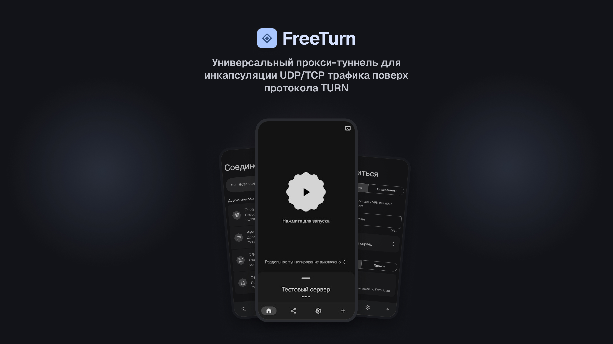

<div align="center">


</div>



> **Disclaimer.** Проект предназначен **исключительно для образовательных и исследовательских целей.**

> **Важно:** При обновлении до версии 3.0.0 все настройки будут сброшены.

## Возможности

- **Добавление нескольких серверов**
- **Клонирование конфигурации серверов**
- **Быстрая установка на VPS**
- **Возможность делиться конфигами**
- **Режим работы прокси / VPN** (WireGuard)
- **UDP-релей до TURN** - бэкенд на сервере только UDP (WireGuard / AmneziaWG)
- **Бэкапы**
- **Раздельное туннелирование**
- **Одноразовые share-ссылки** - защита от пересылки

## Требования

- **Android 7.0+** (API 24)
- **Архитектура процессора:** `arm64-v8a` или `armeabi-v7a`
- **VPS**
- **Ссылка на звонок**

## Сборка из исходников

Нужен JDK 17 и Android SDK (`compileSdk 37`). Ядро прокси (`freeturn.aar`) скачивается
автоматически — версия закреплена в `gradle.properties` (`freeturnAar`).

```bash
./gradlew :app:assembleDebug
```

Сборка `assembleRelease` требует `keystore.properties` (см. `keystore.properties.example`);
приложение должно быть подписано тем же сертификатом, что и уже установленная версия —
иначе встроенный апдейтер отклонит обновление.

> **Быстрая установка на VPS** опирается на серверные скрипты управления
> (`server-control/`), которые в этот репозиторий намеренно не включены.
> Всё остальное (добавление серверов по ссылке, раздельное туннелирование, share-ссылки,
> бэкапы) работает из этого репозитория.
